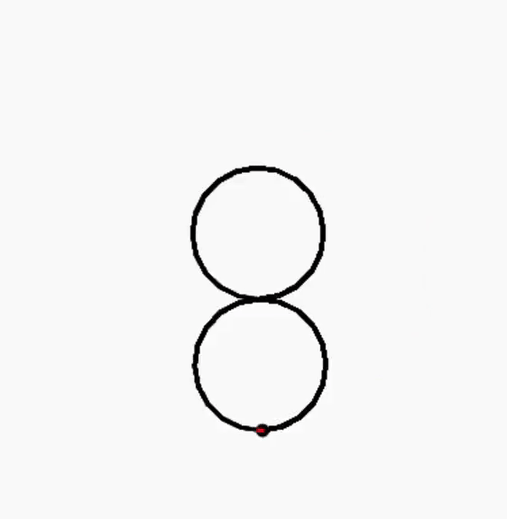

# Turtle-Fun
Fun with turtle programming

## 1. Circles

a. Basic circle-in-Circle

b. Basic circle-around-circle

c. Circular Cardioid! (Heart)

I have also added a more user-friendly version (`Circles/custom-cardioid.py`) without the circles

